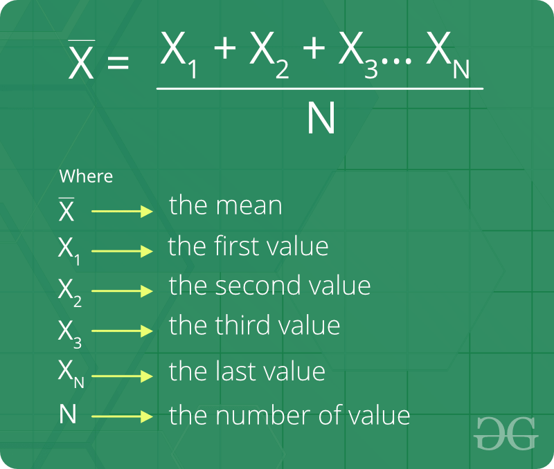
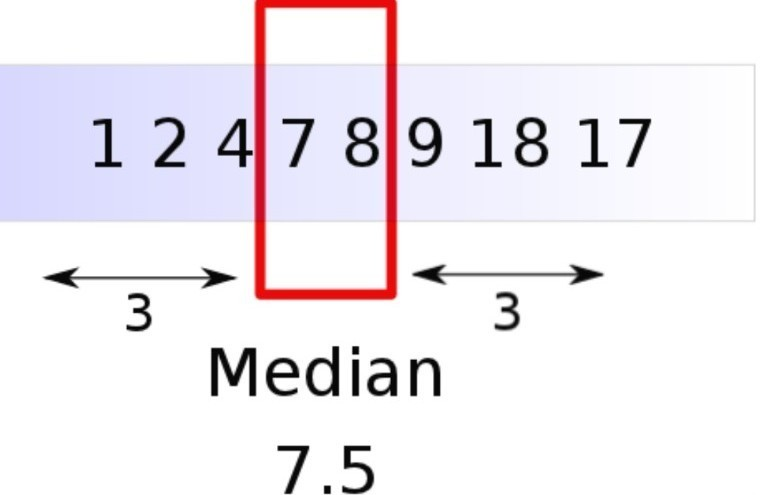
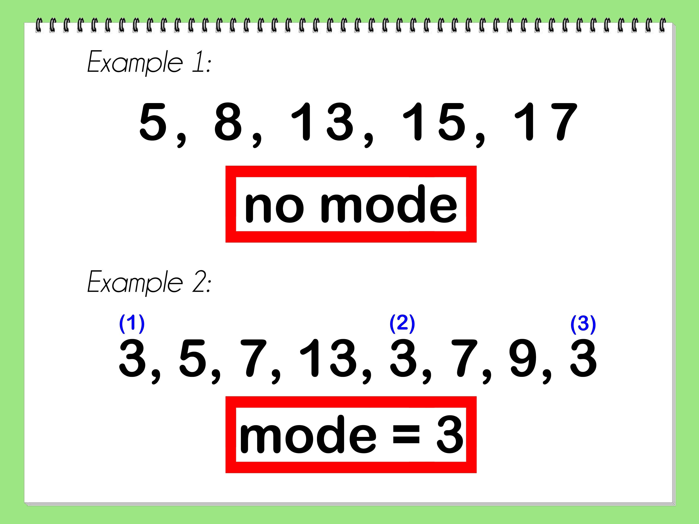
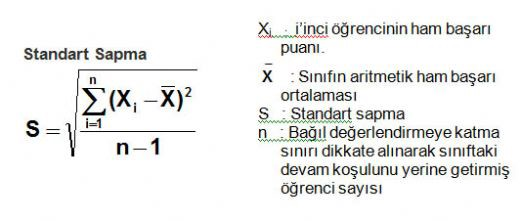
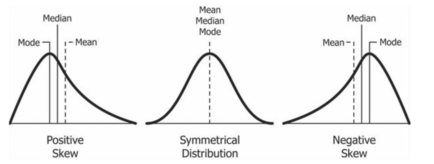
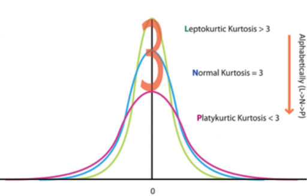

# İçindekiler
- [İçindekiler](#i̇çindekiler)
- [Veri Okuryazarlığı Nedir?](#veri-okuryazarlığı-nedir)
- [Veri Okuryazarlığının Temel Kavramları](#veri-okuryazarlığının-temel-kavramları)
  - [Popülasyon ve Örneklem](#popülasyon-ve-örneklem)
  - [Gözlem Birimi (Observation Unit)](#gözlem-birimi-observation-unit)
  - [Değişken ve Değişken Türleri (Variables - Variable Types)](#değişken-ve-değişken-türleri-variables---variable-types)
  - [Ölçek Türleri (Scale of Measurement)](#ölçek-türleri-scale-of-measurement)
  - [Merkezi Eğilim Ölçüleri](#merkezi-eğilim-ölçüleri)
    - [Aritmetik Ortalama (Arithmetic Mean)](#aritmetik-ortalama-arithmetic-mean)
    - [Medyan (Median)](#medyan-median)
    - [Mod (Mode)](#mod-mode)
    - [Kartiller (Quartiles)](#kartiller-quartiles)
  - [Dağılım Ölçüleri](#dağılım-ölçüleri)
    - [Değişim Aralığı (Range)](#değişim-aralığı-range)
    - [Standart Sapma (Standard Deviation)](#standart-sapma-standard-deviation)
    - [Varyans (Variance)](#varyans-variance)
    - [Çarpıklık (Skewness)](#çarpıklık-skewness)
      - [Pearson Çarpıklık Katsayısı](#pearson-çarpıklık-katsayısı)
    - [Basıklık (Kurtosis)](#basıklık-kurtosis)
- [İstatistiksel Düşünce Modelleri](#i̇statistiksel-düşünce-modelleri)
- [İstatistiksel Düşünce Düzeyleri](#i̇statistiksel-düşünce-düzeyleri)
  - [Kişiye Özgülük (Seviye 1)](#kişiye-özgülük-seviye-1)
  - [Geçici (Seviye 2)](#geçici-seviye-2)
  - [Nicel (Seviye 3)](#nicel-seviye-3)
  - [Analitik (Seviye 4)](#analitik-seviye-4)

# Veri Okuryazarlığı Nedir?
Her türden veri tipini, değişken ve ölçek türlerini tanımlayabilme, betimsel istatistikleri ve istatistiksel grafikleri kullanarak veri değerlendirme yeteneğidir. 

**Veri Görselleştirme**, veri okuryazarlığının önemli bir bileşenidir.

# Veri Okuryazarlığının Temel Kavramları

## Popülasyon ve Örneklem
**Popülasyon**, ilgilendiğimiz **ana/hedef kitle**mizdir. 
**Örneklem** ise popülasyon(ana kitle) içerisinden **seçilmiş olan bir alt küme**dir. 
Örneklemin popülasyonu çok iyi temsil etmesi gerekmektedir. Biz örnekleme popülasyonmuşcasına muamele etmekteyiz. Bu sebeple örneklem **yansız olmalıdır**.

## Gözlem Birimi (Observation Unit)
Gözlem birimi, araştırmada incelediğimiz birimlerdir. Örneklem içerisindeki her bir eleman aslında bizim gözlem birimimizdir.

## Değişken ve Değişken Türleri (Variables - Variable Types)
Değişken; birimden birime farklı değer alan niceliktir. Değişkenler temelde 2'ye ayrılır.
- Sayısal Değişkenler (Nicel,Kantitatif)
  - Ör: Araç Fiyatı (10000, 50000 vs.)
- Kategorik Değişkenler (Nitel,Kalitatif)
  - Ör: Cinsiyet bir kategorik değişkendir. Kadın ve Erkek ise bu kategorik değişkenin (cinsiyet) sınıflarıdır.

## Ölçek Türleri (Scale of Measurement)
Ölçek türü, bir değişkenin değerlerini okuyup anlayabilmemiz için ölçmemiz gerekmektedir. Değikenin türüne göre ölçek türü de değişkenlik göstermektedir. 

Sayısal değişkenler için 2 ölçek türü vardır
- Aralık (Interval)
  - Örnek olarak; elimizde bir sıcaklık değişkeni olduğunu varsayalım. Sıcaklık değişkeni hem '-' hem de '+' değerler alabilir. Bu tür **başlangıç değeri 0 olmayan değişkenler** aralık ölçek türü ile ölçülebilir.
- Oran (Ratio)
  - **Başlangıç noktasını 0 kabul eden değişkenler** ise oran ölçek türü ile ölçülmektedir. Örnek olarak bir aracın fiyatı 0 ise yokluğu temsil eder. Yani aracın fiyatı yoktur. Bu tür değişkenler **oran ölçek türü** ölçülmektedir.

Kategorik değişkenler için de 2 adet ölçek türü vardır
- Nominal
  - Bir kategorik değişkenin **sınıfları arasında fark yok ise** bu nominal ölçek türü ile ölçülmüştür diyebiliriz. 
  - Örnek: Cİnsiyet bir kategorik değişkendir. Kadın ve Erkek ise bu kategorik değişkenin sınıflarıdır. Kadın ve Erkek sınıfları arasında bir fark olmadığı için Cinsiyet kategorik değişkeni nominal ölçek türü ile ölçülebilir. Yani nominaldir.
- Ordinal
  - Kategorinin değişkenin **sınıfları arasında fark var ise** bu ordinal ölçek türü ile ölçülmüştür.
  - Örnek: Rütbe adında bir kategorik değişkenimiz var. Onbaşı,Yüzbaşı,Binbaşı,Albay ise bu kategorik değişkenin sınıflarıdır. Bu sınıflar arasında fark olduğundan dolayı(soldan sağa emir komuta zinciri) rütbe kategorik değişkeni ordinal ölçek türü ile ölçülebilir. Yani ordinaldir.

## Merkezi Eğilim Ölçüleri
Sayısal değişkenlerin ölçümünde kullanılacak ölçüler değişkenlerin odaklaşma noktasını özetlemelidir. Bu tür ölçülere merkezi eğilim ölçüleri denir.

### Aritmetik Ortalama (Arithmetic Mean)
Bir değişkende (seride) yer alan tüm değerlerin toplanması ve birim sayısına bölünmesi ile elde edilen istatistik, sonuçtur.  

Aritmetik ortalama en çok kullanılan merkezi eğilim ölçülerindendir. Elimizdeki değişkenin veya serinin ortalamasını temsil edebilmek adına kullanılır.  

Örnek: Kişisel web sitemizde kullanıcıların geçirdiği süreleri hesaplayan bir yapımız var. Her kullanıcının ne kadar süre geçirdiğini biliyoruz fakat bütün kullanıcıların ortalama ne kadar süre geçirdiğini hesaplamak istersek **aritmetik ortalama**'dan yararlanmalıyız. Bunun sonucunda ortalama 1.5 dk süre geçiriyorlar gibi bir istatistik elde edebiliriz.

### Medyan (Median)
Bir değişkeni, seriyi küçükten büyüğe (<) veya büyükten küçüğe (>) sıraladığımızda seriyi **tam orta noktadan iki eşit parçaya ayıran değer**e medyan denir. 

Elimizde tek sayılı bir seri varsa (mesela 5) bu durumda medyan `(n+1)/2`. terimdir. Yani `(5+1)/2` 'den 3. terim medyandır. Yani `n` tek ise `Medyan = (n+1)/2`
 

Eğer ki seri tam orta noktadan iki eşit parçaya ayrılmıyorsa (mesela 6 gözlem birimli bir seri) bu durumda medyanı bulmak için ` ((n/2).terim + ((n/2)+1).terim)/2` 'den medyan 3. ve 4. elemanların toplamının 2'ye bölümüdür. Yani `n` çift ise `Medyan = ((n/2)+((n/2)+1))/2` 

**Aritmetik ortalama, değişkenin (seri) dağılımının simetrik olduğu bilindiğinde kullanılabilir! Eğer dağılım simetrik değil ise ortalama yanıltıcı olacaktır. Yani uç değerler arasındaki fark çok fazla ise medyan kullanılmalıdır. Aşağıdaki örnek için 190 ve 10**  
Örnek: 13 10 15 12 17 12 19 18 11 12 190 şeklinde bir dağılımımız olduğunu varsayalım. Bu dağılımın **ortalaması 28.5'dir**. **Medyanı ise 13**. Bu dağılımın merkezi eğilim ölçüsünü ölçmek için medyan kullanılması gerekir. Aksi durumda 28.5 değeri bu dağılım için gerçeği yansıtmamaktadır.
 

Aritmetik ortalama ve medyan birbirine ne kadar yakınsa dağılım o kadar düzgündür, homojendir. 

### Mod (Mode)
Bir değiken'de (seri) **en çok tekrar eden değer**dir.

### Kartiller (Quartiles)
Küçükten büyüğe sıralanan **bir seriyi 4 parçaya ayıran değerlere** kartiller(çeyrekler) denir.  

Q1 = (1/4) x (n+1).terim

Q3 = (3/4) x (n+1).terim

Q2 (Medyan) = Q3 - Q1

## Dağılım Ölçüleri
Elimizdeki değişkenin değerlerinin ne şekilde dağıldığını ifade eden ölçülerdir. Değişkenin max, min, ortalama etrafındaki durumunun ne olduğunu anlamamızı sağlayan ölçülerdir.

### Değişim Aralığı (Range)
Bir değişkendeki (seri) max değerden min değeri çıkardığımızda elde ettiğimiz değerdir.  
`Değişim Aralığı = Maksimum Değer - Minimum Değer` 

Örnek: 8 10 15 12 17 20 14 serisinin değişim aralığı -> 20 - 8 = 12'dir.  

Değişim aralığı ufak ise değişkenin dağılımı normaldir. Fakat değişim aralığı büyük ise değişkenin dağılımı farklılık göstermektedir ve uç değerler arasında büyük fark vardır.

### Standart Sapma (Standard Deviation)
Ortalamadan olan sapmanın genel bir ölçüsüdür.  
Her bir gözlem biriminin ortalama değere olan uzaklıklarını aldığımızda ortalamaya olan uzaklığı hesaplamış oluyoruz. 

|                | Popülasyon (Ana Kitle) | Örneklem |
| -------------- | ---------------------- | -------- |
| Ortalama       | μ                      | x̄        |
| Standart Sapma | σ                      | s        |

Ufak bir örnek yapalım:
| Kazanç (xi) | (xi - x̄) | (xi - x̄)2 |
| ---------------------- | ------------------- | ------------------------------- |
| 12                     | (12-24) = -12       | 144                             |
| 15                     | (15-24) = -9        | 81                              |
| 20                     | (20-24) = -4        | 16                              |
| 30                     | (30-24) = 6         | 36                              |
| 45                     | (45-24) = 21        | 441                             |
| 22                     | (22-24) = -2        | 4                               |
| Toplam:                | 0                   | 722                             |

Yukarıdaki örnek için s = √((1/6) x 722) -> 10.97'dir

### Varyans (Variance)
Kısaca standart sapmanın karesidir. Yani ortalamadan olan sapmaların karelerinin ortalamasıdır. 

[Standart Sapma](#standart-sapma-standard-deviation) başlığında bulduğumuz standart sapmanın karesi varyanstır -> s = 10.97, s2 = 120.34

### Çarpıklık (Skewness)
Bir değişkenin (serinin) dağılımının simetrik olamayışıdır. **Simetrik olmayan değişkenleri medyan ile temsil etmemiz (ölçmemiz) gerektiğini biliyoruz :innocent:  

#### Pearson Çarpıklık Katsayısı
Formul -> `(3(x̄ - medyan)) / standart sapma`  

Pearson Çarpıklık Katsayısı -1 ve +1 değerleri arasında yer alır. 

PÇK < 0 -> Negatif Çarpık (soldan)

PÇK > 0 -> Pozitif Çarpık (sağdan)

PÇK = 0 -> Simetrik

### Basıklık (Kurtosis)
Dağılımın basıklığını/sivriliğini gösterir.  

Basıklık Katsayısı = m4 / s4 

m4 = Ortalamaya göre 4. momenti ifade eder -> (∑ni=1(xi - x̄)) / n

s4 = standart sapmanın 4. kuvvetidir.

Moment; terimlerin ortalamadan olan uzaklıklarının 4. kuvvetini almak demektir.

BK = 3 ise dağılım standart normal dağılıma uygundur

BK > 3 ise dağılım sivridir

BK < 3 ise dağılım basıktır

Ufak bir örnek yapalım:
| Kazanç (xi) | (xi - x̄) | (xi - x̄)4 |
| ---------------------- | ------------------- | ------------------------------- |
| 12                     | (12-24) = -12       | 20736                           |
| 15                     | (15-24) = -9        | 6561                            |
| 20                     | (20-24) = -4        | 256                             |
| 30                     | (30-24) = 6         | 1296                            |
| 45                     | (45-24) = 21        | 194481                          |
| 22                     | (22-24) = -2        | 16                              |
| Toplam:                | 0                   | 223346                          |

m4 = 223346 / 6 = 37224.33

s4 = (10.97)4 = 14481.93

m4 / s4 = 37224.33 / 14481.93 = 2.57 ise dağılım basıktır. BK < 3

# İstatistiksel Düşünce Modelleri
Veri okuryazarlığından veri analitiğine giden yolu modelleyen yol göstericilerdir. 

Akademik dünya ve eğitim dünyası için geliştirilen birden fazla modeller vardır. Bu modellerin genel amacı; bir bireyin veriye ilk dokunduğu andan son aşaması olan  veriyle ilgili yorumlar yapabilme ve analitik çıkarımlarda bulunma süreçlerini modelleyen teorik çalışmalardır. Bunlardan bazıları:
- Ben-Zvi ve Friedlander (1997)
- Jones ve diğerleri (2000)
- Wild ve Pfannkuch (1999)
- Hoerl ve Snee (2001)
- Mooney (2002)
  - Diğer düşünce modellerine göre görece daha kolay bir modeldir. Temelde 4 aşamadan oluşur.
    1. Verinin Tanımlanması
    2. Verinin Organize Edilmesi ve İndirgenmesi
    3. Veri Gösterimi
    4. Verinin Analiz Edilmesi ve Yorumlanması

# İstatistiksel Düşünce Düzeyleri
## Kişiye Özgülük (Seviye 1)
Bu basamakta kişiler veri setlerine bakarak verideki değişkenleri vb. anlamlandıramazlar. Mod, medyan vb. terimleri kullanarak bir çıktı elde edemezler. Veri ile ilk temas anındaki okur yazarlıktan yoksun olunan seviyedir.
## Geçici (Seviye 2)
Nicel düşünmenin öneminin farkedilmeye başlandığı seviyedir. Her zaman doğru olmasa da merkezi yayılım ve eğilim ölçüleri yorumlanabilir ve sayılarla ifade edilebilir hale gelinir. Veri üzerindeki bakış açısı tek yönlüdür. Veri temsilleri veya veri analizlerine dair bağlantılar tam anlamıyla kurulamaz.
## Nicel (Seviye 3)
Merkezi eğilim ve yayılım ölçülerinin doğru bir şekilde anlaşılmaya başlandığı basamaktır. Kişi bu seviyede istatistiksel kararlar almak için nicel verilere başvurabilir.Bağlam ve verinin ikisininde bilincindedir.
## Analitik (Seviye 4)
Veriyi inceleme, yorumlama ve analiz etmede analitik bir yaklaşım kullanılır. Veri ve bağlam arasında bir ilişki kurulur ve bu ilişkiye kanıtlar gösterilebilir. 