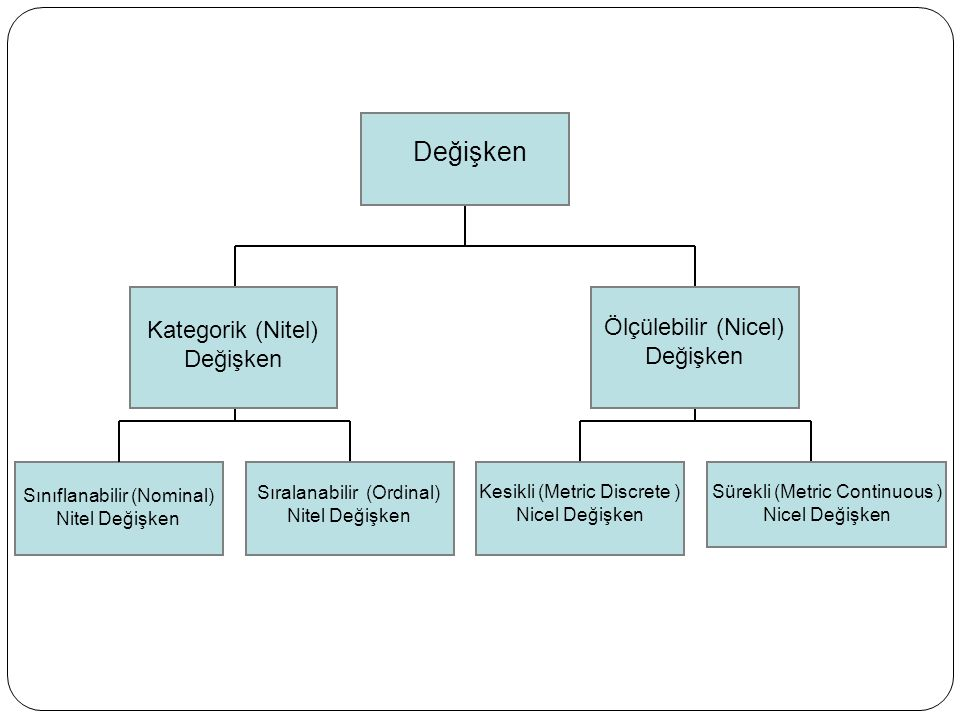

# İçindekiler
- [İçindekiler](#i̇çindekiler)
- [Veri Okuryazarlığı Nedir?](#veri-okuryazarlığı-nedir)
- [Veri Okuryazarlığının Temel Kavramları](#veri-okuryazarlığının-temel-kavramları)
  - [Popülasyon ve Örneklem](#popülasyon-ve-örneklem)
  - [Gözlem Birimi (Observation Unit)](#gözlem-birimi-observation-unit)
  - [Değişken ve Değişken Türleri (Variables - Variable Types)](#değişken-ve-değişken-türleri-variables---variable-types)

# Veri Okuryazarlığı Nedir?
Her türden veri tipini, değişken ve ölçek türlerini tanımlayabilme, betimsel istatistikleri ve istatistiksel grafikleri kullanarak veri değerlendirme yeteneğidir. 

**Veri Görselleştirme**, veri okuryazarlığının önemli bir bileşenidir.

# Veri Okuryazarlığının Temel Kavramları

## Popülasyon ve Örneklem
**Popülasyon**, ilgilendiğimiz **ana/hedef kitle**mizdir. 
**Örneklem** ise popülasyon(ana kitle) içerisinden **seçilmiş olan bir alt küme**dir. 
Örneklemin popülasyonu çok iyi temsil etmesi gerekmektedir. Biz örnekleme popülasyonmuşcasına muamele etmekteyiz. Bu sebeple örneklem **yansız olmalıdır**.

## Gözlem Birimi (Observation Unit)
Gözlem birimi, araştırmada incelediğimiz birimlerdir. Örneklem içerisindeki her bir eleman aslında bizim gözlem birimimizdir.

## Değişken ve Değişken Türleri (Variables - Variable Types)
Değişken; birimden birime farklı değer alan niceliktir. Değişkenler temelde 2'ye ayrılır.
- Sayısal Değişkenler (Nicel,Kantitatif)
  - Ör: Araç Fiyatı (10000, 50000 vs.)
- Kategorik Değişkenler (Nitel,Kalitatif)
  - Ör: Erkek - Kadın, Manuel - Otomatik

