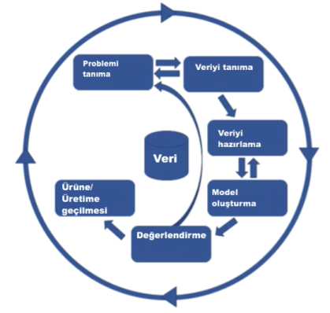

- [Giriş](#giriş)
  - [Kaynaklar](#kaynaklar)
- [Bilgi Nedir?](#bilgi-nedir)
- [Bilgi Piramidi Nedir?](#bilgi-piramidi-nedir)
- [Veri Bilimi ve Veri Bilimci Nedir?](#veri-bilimi-ve-veri-bilimci-nedir)
- [Veriden Faydalı Bilgi Çıkarmak](#veriden-faydalı-bilgi-çıkarmak)
- [Veri Bilimi Uygulama Şeması](#veri-bilimi-uygulama-şeması)
  - [CRISP-DM: İş Anlayışı](#crisp-dm-i̇ş-anlayışı)
- [Makine Öğrenimi Nedir?](#makine-öğrenimi-nedir)
  - [Regression](#regression)
  - [Classifiction](#classifiction)
  - [Neural Networks (Yapay Sinir Ağları)](#neural-networks-yapay-sinir-ağları)
  - [Clustering](#clustering)
- [Veri Setlerine Erişelim](#veri-setlerine-erişelim)
  - [Kaggle](#kaggle)
  - [Google Data Set Search](#google-data-set-search)
  - [İBB Açık Veri Portalı](#i̇bb-açık-veri-portalı)
  - [DrDataStats](#drdatastats)
- [Kaynakça](#kaynakça)

# Giriş

> *Yaşamın içinde kaybettiğimiz hayat nerede?*  
> *Bilginin içinde kaybettiğimiz bilgelik nerede?*  
> *Enformasyonun içinde kaybettiğimiz bilgi nerede?*  
> *T.S. Eliot (1934)*

Bu repoyu **Veri Bilimi** konu başlığı altında **Yoldaki Notlar**'ımı paylaşabilmek için hazırlamaya çalışıyorum.  
## Kaynaklar
Okuduğum, izlediğim, öğrendiğim kaynaklar:
* [Yeni Başlayanlar İçin Veri Bilimine Giriş (Online Kurs)](https://www.udemy.com/course/yeni-baslayanlar-icin-veri-bilimine-giris/) - Data Forest TR
* [Veri Bilimi Ve Yapay Zekaya Giriş (Online Kurs)](https://www.udemy.com/course/veri-bilimi-ve-yapay-zekaya-giris/) - Vahit Keskin
* [Python A-Z: Veri Bilimi ve Machine Learning (Online Kurs)](https://www.udemy.com/course/python-egitimi/) - Vahit Keskin & [Veri Bilimi Okulu](https://www.veribilimiokulu.com/)
* [Bilgi ve Bilginin Yönetimi (Kitap)](http://www.papatya.gen.tr/bilgiVeBilgininYonetimi.htm) - Doç. Dr. Sevinç Gülseçen (Editör)
* [Bilgi Yönetimi (Kitap)](http://www.papatya.gen.tr/bilgi_yonetimi_buyuk_veri_inovasyon.htm) - Prof. Dr. Sevinç Gülseçen (Editör)
* [Olasılık ve İstatistik (Kitap)](https://www.amazon.com.tr/Olas%C4%B1l%C4%B1k-ve-%C4%B0statistik-Fikri-Akdeniz/dp/6052396415) - Prof. Dr. Fikri Akdeniz
* [Stanford Üniversitesi Makine Öğrenmesi El Kitabı (PDF)](https://stanford.edu/~shervine/l/tr/teaching/cs-229/)

# Bilgi Nedir?
Felsefe disiplininde, bilgi teorisinin odağında ünlü filozof Plato'nun bilginin doğasıyla ilgili düşünceleri yer almaktadır. Ona göre, bilginin hem gerekçelendirilmiş hem doğru hem de inanılır olma kriterlerini karşılaması gerekmektedir; onun ünlü tanımıyla bilgi, **gerekçelendirilmiş doğru inançtır** ("justified true belief")(Musgrave,1993).

Bilgi günümüzde hala tartışılan bir kavram olsa da Bilgi Yönetimi ve Bilişim disiplinlerinde işlevselliği ön plana alınarak tanımlanan bir kavramdır. Bilginin, kavramsal boyuttan çıkıp uygulama boyutunda ele alındığı bu disiplinler söz konusu olduğunda bilginin tanımının farklı şekillerde açımlandırıldığı görülmektedir ([1](#kaynakça)).

# Bilgi Piramidi Nedir?
Bilgi yönetimi alanında çalışan araştırmacılardan Ackoff (1989), insan zihnindeki içeriğin beş kategoride sınıflandırıldığını belirtmektedir: **Veri, enformasyon, bilgi, anlayış ve bilgelik**. 
+ **Veri**, işlenmemiş niteliktedir ve tek başına bir anlam ifade etmemektedir (Ham gerçekler).
+ **Enformasyon**, verilerin ilişkisel olarak anlamlandırılmasıdır; bu anlam hem yararlı hem de yararsız olabilir.
+ **Bilgi**, enformasyonun yararlı olması amacı ile uygun bir şekilde birlikte bir araya getirilmesidir.
+ **Anlayış**, yeni bilginin sentezlenmesidir.
  + Bilgi ile  anlayış arasında bilişsel süreçlerin işin içinde olup olmaması açısından fark vardır. Bilgi ezber düzeyinde iken anlayışta bilişsel süreçler dahil edilerek öğrenme boyutuna varılır
+ **Bilgelik**; idrak etme, ayırt etme, değerlendirme, karar verme sürecidir.

Ackoof'un sınıflandırmasına dayanan DIKW (Data-Information-Knowledge-Wisdom) hiyerarşisi, bilgi ve bilgi yönetimi ile ilişkili alanyazında yer edinmiş olan bir modeldir. Ackoff'un sınıflandırılmasında yer alan **anlayış (understanding)** ise doğrudan bir aşama olarak değil her bir aşamadan diğerine geçişi destekleyen bir unsur olarak ele alınmıştır ([2](#kaynakça)).

Tüm bu DIKW hiyerarşisine (Veri -> Enformasyon -> Bilgi -> Bilgelik) **Bilgi Piramidi** denmektedir.
 

# Veri Bilimi ve Veri Bilimci Nedir?
Veri bilimi **multidisipliner bir alandır**. Kısaca veriden faydalı bilgi çıkarma sürecidir. 

Bu süreci yöneten kişiye ise **veri bilimci** denmektedir. Aşağıdaki görselde bir veri bilimcide bulunan/bulunması gereken özellikler gösterilmiştir.

# Veriden Faydalı Bilgi Çıkarmak
Veriden faydalı bilgi çıkarmak için temelde 4 adet yaklaşım vardır.
1. Betimleyici Analitik (Descriptive Analytics)
   - Verilerin betimlemesini yaparız. Veriler **Ne olmuş?** sorusuna cevap verir. Mevcut durumu resmeder.
2. Teşhis/Tanı Analitiği (Diagnoistic Analytics)
   - Veriler **Neden Olmuş?** sorusuna cevap verir.
3. Tahminsel Analitik (Predictive Analytics)
   - Veriler **Ne Olacak?** sorusuna cevap verir. İş süreçlerini geleceğe yönelik optimize etmemizi sağlar.
4. Yönergeli Analitik (Prescriptive Analytics)
   - Veriler **Ne Olmalı?/Nasıl Olmalı?** gibi sorulara cevap verir.

# Veri Bilimi Uygulama Şeması
1. Problemi Anlamak
2. Veri Toplamak
3. Veri Hazırlamak
   - Ham verilerden bilgi üretilir
4. Keşifsel Veri Analizi
    - Elimizdeki veriyi anlamaya çalışırız
5. Veri Modelleme
    - Makine öğrenimi algoritmaları vb. Enformasyon katmanından Bİlgi katmanına geçiş yaparız
6. Optimizasyon 
   - Bilgi katmanından Bilgelik katmanına geçiş aşamasıdır
7. Görselleştirme ve İletişim
   - İlk 6 adımda yapılan çalışmalar anlatılır
8. Üretim ve Devamlılık
    - Veri Bİlimi projesinin gerçek hayatta kullanıldığı ve sonuçlar üretmeye başlaması

## CRISP-DM: İş Anlayışı
İş dünyasındaki veri bilimi süreçlerinin akışını modelleyen metodolojilerden birisi de **CRISP-DM**'dir. Veri bilimi süreçlerinin iş dünyasındaki ele alınışıdır. Sıfırdan ürün geliştirme işlemi bu metodolojiye uygun olarak yapılır. Adımları şunlardır:
1. Veriyi Anlamak
2. Verinin Hazırlanması
3. Modelleme
4. Değerlendirme
5. Kullanıma Sokma

# Makine Öğrenimi Nedir?
Makine öğrenimi, bizim bilgi piramidinde 2. basamaktan (Enformasyon) 3. basamağa (Bilgi) çıkmamızı sağlar.  
Makine öğrenimi sayesinde **veriden elde ettiğimiz enformasyonu bilgiye dönüştürebiliriz.**  
Temelde 2'ye ayrılmaktadır.
1. Supervised (Güdümlü/Gözetimli) Öğrenme
   1. Regression
   2. Classification (Sınıflandırma)
   3. Neural Networks
      - Neural Network'ler kompleksleşmeye başladıklarında Deep Learning'e evrilebilmektedir
2. Un-supervised (Güdümsüz/Gözetimsiz) Öğrenme
   1. Clustering (Kümeleme)

## Regression
- Regression metotları Supervised Learning metotlarının başında gelmektedir.
- Bu metot ile hedef değişkenimizi (target variable) tahmin etmeye çalışırız. Hedef değişkenler genelde `y` ile gösterilir.
- Hedef değer numeriktir.
- Hedef değişkenleri tahminlerken kullanılan değişkenlere de **independent variables** (bağımsız değişkenler) denmektedir. Bu değişkenler de genellikle `x` ile gösterilir.
## Classifiction
- Classifiction metotları da Supervised Learning grubuna aittir
- Hedef değerimiz (target variable) numerik değildir. Bir gruba ait olmayı veya olmamayı temsil eder. Yani hedef değerimiz 0 veya 1'dir.
- y = {0,1}
## Neural Networks (Yapay Sinir Ağları)
- Supervised Learning teknikleri ile kullanılıyorlar
- Fakat esneklikleri sebebiyle hem regression hem de classifiction problemlerini çözebilmektedirler
- Geliştikçe deep learning (derin öğrenme) algoritmalarını oluşturuyorlar
- Inputl'lardan output elde etmeye çalışılır
- Temelde 3 katmandan oluşmaktadır
  1. katmanına **input layer (x)** 
  2. katmanına **hidden layer**
  3. katmanına **output layer (y)** denmektedir 
## Clustering
- Unsupervised Learning tekniklerini kullanır
- Hedef değişken yoktur
- Veriler kendi benzer özelliklerine göre farklı kümelere ayrılır

# Veri Setlerine Erişelim
## Kaggle
[Kaggle](https://www.kaggle.com/) üzerinden örnek veri setleri bulabiliriz. Aynı zamanda veri bilimcilerin yaptıkları çalışmaları gözlemleyebiliriz.

## Google Data Set Search
[Google Data Set Search](https://datasetsearch.research.google.com/) ile veri setleri bulabiliriz. Google tarafından veri setleri aramak için geliştirilmiş bir arama motorudur.

## İBB Açık Veri Portalı
[İBB Açık Veri Portalı](https://data.ibb.gov.tr/) İstanbul Büyükşehir Belediyesi tarafından geliştirilmiş, İstanbul'a ait verilerin bulunduğu platformdur. 

## DrDataStats
[DrDataStats](https://www.drdatastats.com/) mottosu "Sadece Veri, Sadece İstatistik (Only Data, Only Statistics)" olan web sitesidir. Aynı zamanda [Din](https://www.drdatastats.com/din/) bölümü çok hoşuma gitti.

# Kaynakça
1. Gülseçen, Sevinç. (Ed.) (2015). Bilgi Yönetimi. İstanbul: Papatya Yayıncılık
2. Gülseçen, Sevinç. (Ed.) (2015). Bilgi Yönetimi. İstanbul: Papatya Yayıncılık